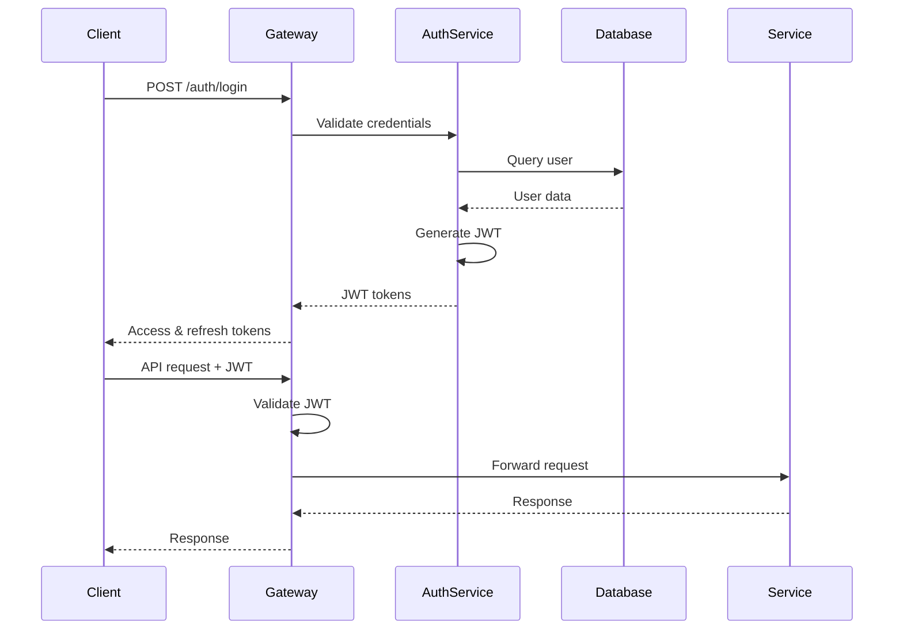

# StellarRec Backend API Design Document

## Overview

The StellarRec Backend API is a microservices-based RESTful API built with modern cloud-native architecture. It leverages AI/ML services, implements robust security measures, and provides scalable endpoints for the university application platform. The API follows OpenAPI 3.0 specifications and implements industry best practices for performance, security, and maintainability.

## Architecture

### High-Level Architecture

```
┌─────────────────┐    ┌─────────────────┐    ┌─────────────────┐
│   Web Client    │    │   Mobile App    │    │  University     │
│   (React/Vue)   │    │   (iOS/Android) │    │  Integration    │
└─────────┬───────┘    └─────────┬───────┘    └─────────┬───────┘
          │                      │                      │
          └──────────────────────┼──────────────────────┘
                                 │
                    ┌─────────────▼─────────────┐
                    │     API Gateway          │
                    │   (Authentication,       │
                    │   Rate Limiting,         │
                    │   Load Balancing)        │
                    └─────────────┬─────────────┘
                                 │
        ┌────────────────────────┼────────────────────────┐
        │                       │                        │
┌───────▼────────┐    ┌─────────▼────────┐    ┌─────────▼────────┐
│  User Service  │    │  AI/ML Service   │    │ Application      │
│  - Auth        │    │  - Matching      │    │ Service          │
│  - Profiles    │    │  - Essay Analysis│    │ - Tracking       │
│  - Permissions │    │  - Predictions   │    │ - Deadlines      │
└───────┬────────┘    └─────────┬────────┘    └─────────┬────────┘
        │                       │                        │
        └───────────────────────┼────────────────────────┘
                               │
    ┌──────────────────────────┼──────────────────────────┐
    │                          │                          │
┌───▼────────┐    ┌───────────▼────────┐    ┌───────────▼────────┐
│ Letter     │    │ Notification       │    │ Analytics          │
│ Service    │    │ Service            │    │ Service            │
│ - Writing  │    │ - Email/SMS        │    │ - Metrics          │
│ - Delivery │    │ - Push Alerts      │    │ - Insights         │
└───┬────────┘    └───────────┬────────┘    └───────────┬────────┘
    │                         │                         │
    └─────────────────────────┼─────────────────────────┘
                             │
              ┌──────────────▼──────────────┐
              │     Data Layer              │
              │  - PostgreSQL (Primary)     │
              │  - Redis (Cache/Sessions)   │
              │  - Elasticsearch (Search)   │
              │  - S3 (File Storage)        │
              └─────────────────────────────┘
```

### Microservices Architecture

#### Core Services

1. **API Gateway Service**
   - Authentication and authorization
   - Rate limiting and throttling
   - Request routing and load balancing
   - API versioning and documentation

2. **User Management Service**
   - User registration and authentication
   - Profile management (students, recommenders, institutions)
   - Role-based access control
   - Account settings and preferences

3. **AI/ML Service**
   - University matching algorithms
   - Essay analysis and optimization
   - Predictive analytics
   - Natural language processing

4. **Application Management Service**
   - Application lifecycle tracking
   - Deadline management
   - Progress monitoring
   - University integration

5. **Letter Management Service**
   - Recommendation letter workflows
   - Collaborative editing
   - Template management
   - Delivery tracking

6. **Notification Service**
   - Multi-channel notifications (email, SMS, push)
   - Scheduled reminders
   - Real-time alerts
   - Preference management

7. **Analytics Service**
   - Performance metrics
   - Success predictions
   - Data visualization
   - Reporting and insights

8. **File Management Service**
   - Document upload and storage
   - Version control
   - Secure sharing
   - Format conversion

## Components and Interfaces

### API Gateway

**Technology Stack:** Kong/AWS API Gateway
**Responsibilities:**
- JWT token validation
- Rate limiting (100 requests/minute per user)
- Request/response transformation
- API documentation (Swagger UI)

**Key Endpoints:**
```
POST /auth/login
POST /auth/refresh
GET  /auth/me
POST /auth/logout
```

### User Management Service

**Technology Stack:** Node.js/Express, PostgreSQL
**Database Schema:**
```sql
-- Users table
CREATE TABLE users (
    id UUID PRIMARY KEY DEFAULT gen_random_uuid(),
    email VARCHAR(255) UNIQUE NOT NULL,
    password_hash VARCHAR(255) NOT NULL,
    role user_role NOT NULL,
    created_at TIMESTAMP DEFAULT NOW(),
    updated_at TIMESTAMP DEFAULT NOW()
);

-- Student profiles
CREATE TABLE student_profiles (
    user_id UUID PRIMARY KEY REFERENCES users(id),
    first_name VARCHAR(100) NOT NULL,
    last_name VARCHAR(100) NOT NULL,
    gpa DECIMAL(3,2),
    graduation_year INTEGER,
    academic_interests TEXT[],
    target_programs TEXT[],
    profile_data JSONB
);

-- Recommender profiles
CREATE TABLE recommender_profiles (
    user_id UUID PRIMARY KEY REFERENCES users(id),
    first_name VARCHAR(100) NOT NULL,
    last_name VARCHAR(100) NOT NULL,
    title VARCHAR(200),
    institution VARCHAR(200),
    department VARCHAR(200),
    expertise_areas TEXT[],
    profile_data JSONB
);
```

**Key Endpoints:**
```
POST /api/v1/users/register
GET  /api/v1/users/profile
PUT  /api/v1/users/profile
POST /api/v1/users/upload-avatar
DELETE /api/v1/users/account
```

### AI/ML Service

**Technology Stack:** Python/FastAPI, TensorFlow/PyTorch, scikit-learn
**ML Models:**
- University Matching: Collaborative Filtering + Content-Based
- Essay Analysis: BERT-based NLP model
- Success Prediction: Gradient Boosting Classifier

**Key Endpoints:**
```
POST /api/v1/ai/university-matches
POST /api/v1/ai/essay-analysis
POST /api/v1/ai/success-prediction
POST /api/v1/ai/writing-suggestions
GET  /api/v1/ai/model-status
```

**University Matching Algorithm:**
```python
def calculate_university_match(student_profile, university_data):
    # Weighted scoring algorithm
    academic_score = calculate_academic_fit(student_profile.gpa, 
                                          student_profile.test_scores,
                                          university_data.requirements)
    
    interest_score = calculate_interest_alignment(student_profile.interests,
                                                university_data.programs)
    
    location_score = calculate_location_preference(student_profile.location_pref,
                                                 university_data.location)
    
    # Weighted combination
    final_score = (academic_score * 0.4 + 
                  interest_score * 0.35 + 
                  location_score * 0.25)
    
    return {
        'match_percentage': final_score,
        'confidence': calculate_confidence(student_profile),
        'reasoning': generate_match_reasoning(academic_score, interest_score, location_score)
    }
```

### Application Management Service

**Technology Stack:** Node.js/Express, PostgreSQL, Redis
**Database Schema:**
```sql
CREATE TABLE applications (
    id UUID PRIMARY KEY DEFAULT gen_random_uuid(),
    student_id UUID REFERENCES users(id),
    university_id UUID REFERENCES universities(id),
    program_id UUID REFERENCES programs(id),
    status application_status DEFAULT 'draft',
    progress_percentage INTEGER DEFAULT 0,
    deadline DATE NOT NULL,
    submitted_at TIMESTAMP,
    created_at TIMESTAMP DEFAULT NOW()
);

CREATE TABLE application_components (
    id UUID PRIMARY KEY DEFAULT gen_random_uuid(),
    application_id UUID REFERENCES applications(id),
    component_type VARCHAR(50) NOT NULL,
    status component_status DEFAULT 'pending',
    data JSONB,
    completed_at TIMESTAMP
);
```

**Key Endpoints:**
```
POST /api/v1/applications
GET  /api/v1/applications
PUT  /api/v1/applications/{id}
POST /api/v1/applications/{id}/submit
GET  /api/v1/applications/{id}/progress
```

### Letter Management Service

**Technology Stack:** Node.js/Express, PostgreSQL, WebSocket
**Real-time Collaboration:** Socket.io for live editing
**Database Schema:**
```sql
CREATE TABLE recommendation_letters (
    id UUID PRIMARY KEY DEFAULT gen_random_uuid(),
    student_id UUID REFERENCES users(id),
    recommender_id UUID REFERENCES users(id),
    title VARCHAR(200) NOT NULL,
    content TEXT,
    status letter_status DEFAULT 'draft',
    template_id UUID REFERENCES letter_templates(id),
    created_at TIMESTAMP DEFAULT NOW(),
    updated_at TIMESTAMP DEFAULT NOW()
);

CREATE TABLE letter_deliveries (
    id UUID PRIMARY KEY DEFAULT gen_random_uuid(),
    letter_id UUID REFERENCES recommendation_letters(id),
    university_id UUID REFERENCES universities(id),
    delivery_method delivery_method_type,
    status delivery_status DEFAULT 'pending',
    delivered_at TIMESTAMP,
    confirmation_id VARCHAR(100)
);
```

**Key Endpoints:**
```
POST /api/v1/letters
GET  /api/v1/letters
PUT  /api/v1/letters/{id}
POST /api/v1/letters/{id}/deliver
GET  /api/v1/letters/{id}/deliveries
WebSocket /api/v1/letters/{id}/collaborate
```

## Data Models

### Core Entities

#### User Model
```typescript
interface User {
  id: string;
  email: string;
  role: 'student' | 'recommender' | 'institution' | 'admin';
  profile: StudentProfile | RecommenderProfile | InstitutionProfile;
  preferences: UserPreferences;
  createdAt: Date;
  updatedAt: Date;
}
```

#### University Model
```typescript
interface University {
  id: string;
  name: string;
  location: {
    city: string;
    state: string;
    country: string;
  };
  ranking: {
    overall: number;
    byProgram: Record<string, number>;
  };
  admissionRequirements: {
    minGPA: number;
    testScores: {
      SAT?: { min: number; max: number };
      GRE?: { min: number; max: number };
    };
    essays: EssayRequirement[];
    recommendations: number;
  };
  programs: Program[];
  deadlines: Record<string, Date>;
  integrationConfig: UniversityIntegration;
}
```

#### Application Model
```typescript
interface Application {
  id: string;
  studentId: string;
  universityId: string;
  programId: string;
  status: 'draft' | 'in_progress' | 'submitted' | 'accepted' | 'rejected';
  components: ApplicationComponent[];
  progressPercentage: number;
  deadline: Date;
  submittedAt?: Date;
  timeline: TimelineEvent[];
}
```

#### Recommendation Letter Model
```typescript
interface RecommendationLetter {
  id: string;
  studentId: string;
  recommenderId: string;
  title: string;
  content: string;
  status: 'draft' | 'in_review' | 'approved' | 'delivered';
  templateId?: string;
  aiSuggestions: AISuggestion[];
  deliveries: LetterDelivery[];
  collaborators: Collaborator[];
  versions: LetterVersion[];
}
```

## Error Handling

### Error Response Format
```typescript
interface APIError {
  error: {
    code: string;
    message: string;
    details?: any;
    timestamp: string;
    requestId: string;
  };
}
```

### Error Codes
```typescript
enum ErrorCodes {
  // Authentication
  INVALID_CREDENTIALS = 'AUTH_001',
  TOKEN_EXPIRED = 'AUTH_002',
  INSUFFICIENT_PERMISSIONS = 'AUTH_003',
  
  // Validation
  INVALID_INPUT = 'VAL_001',
  MISSING_REQUIRED_FIELD = 'VAL_002',
  INVALID_FORMAT = 'VAL_003',
  
  // Business Logic
  APPLICATION_DEADLINE_PASSED = 'BIZ_001',
  LETTER_ALREADY_SUBMITTED = 'BIZ_002',
  UNIVERSITY_NOT_FOUND = 'BIZ_003',
  
  // System
  INTERNAL_SERVER_ERROR = 'SYS_001',
  SERVICE_UNAVAILABLE = 'SYS_002',
  RATE_LIMIT_EXCEEDED = 'SYS_003'
}
```

## Testing Strategy

### Unit Testing
- **Framework:** Jest (Node.js), pytest (Python)
- **Coverage Target:** 90%+
- **Focus Areas:** Business logic, data validation, error handling

### Integration Testing
- **Framework:** Supertest (API endpoints), Docker Compose (service integration)
- **Database:** Test database with fixtures
- **External Services:** Mock AI/ML services, university APIs

### End-to-End Testing
- **Framework:** Cypress/Playwright
- **Scenarios:** Complete user workflows, cross-service interactions
- **Environment:** Staging environment with production-like data

### Performance Testing
- **Framework:** Artillery.js, k6
- **Metrics:** Response time, throughput, error rate
- **Load Targets:** 1000 concurrent users, 10,000 requests/minute

### Security Testing
- **Tools:** OWASP ZAP, Snyk
- **Focus:** SQL injection, XSS, authentication bypass
- **Compliance:** FERPA, GDPR requirements

## API Documentation

### OpenAPI Specification
```yaml
openapi: 3.0.3
info:
  title: StellarRec Backend API
  description: AI-powered university application platform API
  version: 1.0.0
  contact:
    name: StellarRec API Team
    email: api@stellarrec.com
servers:
  - url: https://api.stellarrec.com/v1
    description: Production server
  - url: https://staging-api.stellarrec.com/v1
    description: Staging server

paths:
  /auth/login:
    post:
      summary: User authentication
      tags: [Authentication]
      requestBody:
        required: true
        content:
          application/json:
            schema:
              type: object
              properties:
                email:
                  type: string
                  format: email
                password:
                  type: string
                  minLength: 8
      responses:
        '200':
          description: Successful authentication
          content:
            application/json:
              schema:
                type: object
                properties:
                  accessToken:
                    type: string
                  refreshToken:
                    type: string
                  user:
                    $ref: '#/components/schemas/User'
```

### Rate Limiting
```yaml
Rate Limits:
  - Endpoint: /api/v1/ai/*
    Limit: 10 requests/minute per user
    Burst: 20 requests
  
  - Endpoint: /api/v1/auth/login
    Limit: 5 requests/minute per IP
    Burst: 10 requests
  
  - Endpoint: /api/v1/*
    Limit: 100 requests/minute per user
    Burst: 200 requests
```

## Security Implementation

### Authentication Flow


### Data Encryption
- **In Transit:** TLS 1.3 for all API communications
- **At Rest:** AES-256 encryption for sensitive data
- **Database:** Transparent Data Encryption (TDE)
- **Files:** Client-side encryption before upload

### Access Control
```typescript
interface Permission {
  resource: string;
  action: 'create' | 'read' | 'update' | 'delete';
  conditions?: {
    ownResource?: boolean;
    roleRequired?: string[];
    customRule?: string;
  };
}

const permissions: Record<string, Permission[]> = {
  student: [
    { resource: 'applications', action: 'create' },
    { resource: 'applications', action: 'read', conditions: { ownResource: true } },
    { resource: 'letters', action: 'read', conditions: { ownResource: true } }
  ],
  recommender: [
    { resource: 'letters', action: 'create' },
    { resource: 'letters', action: 'update', conditions: { ownResource: true } },
    { resource: 'students', action: 'read', conditions: { customRule: 'hasLetterRequest' } }
  ]
};
```

This comprehensive design document provides the foundation for implementing a robust, scalable, and secure backend API for the StellarRec platform. The architecture supports all the requirements while maintaining flexibility for future enhancements and integrations.